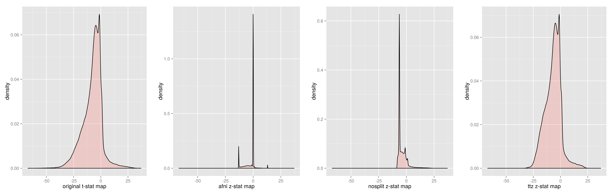

# TtoZ

TtoZ is a python implementation of Hughett's t-to-z tranform for whole brain statistical maps. 

For background about the problem, see [Hughett's paper](doc/JStats_Hughett.pdf). For a detailed example of the problem pertaining to whole brain statistical maps, see [this ipython notebook](http://nbviewer.ipython.org/github/vsoch/TtoZ/blob/master/doc/t_to_z_procedure.ipynb). For a more concise summary of the particular problems addressed by Hughett's algorithm, as compared to traditional procedures using scipy see [this ipython notebook](http://nbviewer.ipython.org/github/vsoch/TtoZ/blob/master/doc/TtoZ_method_comparison.ipynb).  While we have not robustly tested against AFNI (3dcalc) and [FSLs](http://www.fmrib.ox.ac.uk/analysis/techrep/tr08ss1/tr08ss1.pdf), we have used both tools and see truncation in the distributions of Z values. [An image produced with AFNI's 3D calc](example/zstat_afni.nii) from the equivalent data in the example is included with this package.

# Installation

     pip install git+https://github.com/vsoch/TtoZ.git

# Usage

     usage: TtoZ [-h] [--output_nii OUTPUT_NII] t_stat_map dof

     Convert a whole brain T score map to a Z score map without loss of precision
     for strongly positive and negative values.

     positional arguments:
  
       t_stat_map       T-score statistical map in the form of a 3D NIFTI file (.nii or .nii.gz).
  
       dof              Degrees of freedom (number of subjects in group - 2)

      optional arguments:
       
       -h, --help               show this help message and exit
  
       --output_nii OUTPUT_NII  The name for the output Z-Score Map.

# Example

     TtoZ t_stat_map.nii.gz 484 z_score_map.nii

Here we show the image histograms (from mricron) for: 1) the original t-stat map, 2) a z-score map produced with AFNI's 3dcalc (`3dcalc -a tstat.nii.gz -expr 'fitt_t2z (a,484)' -prefix afni_zstat.nii -float`), 3) a z-score map produced using scipy.stats (method equivalent to TtoZ EXCEPT not splitting into positive and negative values), and 4) a z-score map produced with TtoZ (Hughett's method that splits at 0 into two sets first). 2) and 3) have truncation of the distributions.  For both 3) and 4) it was also necessary to convert p-values exactly == 1 to 0.999999, as a value of exactly 1 will be converted to inf when converted to the standard normal score.

  

